## PROJECT DESCRIPION: ---

The breif for this project was to design and produce a web app of my choice. 
The requirements for the application; included CRUD (create, read update and delete) functionality,
Flask micro-framework, and had to store inofrmation into a MySQL database with a minimum of two tables sharing a one-to-many ralationship:

## APP DESIGN: ---

I have chosen to build a question-bank app, which allows users to write questions to the bank(create functionality).
View questions that have been posted by other users(read functionality).
Update the status of questions whether they have been answered or not (update functionality).
Delete questions(delete functionality).

The database for this program comprises of a Users table and a Questions table which associates with multiple questions to one user(One-To-Many relationship).
The ERD is displayed below: 

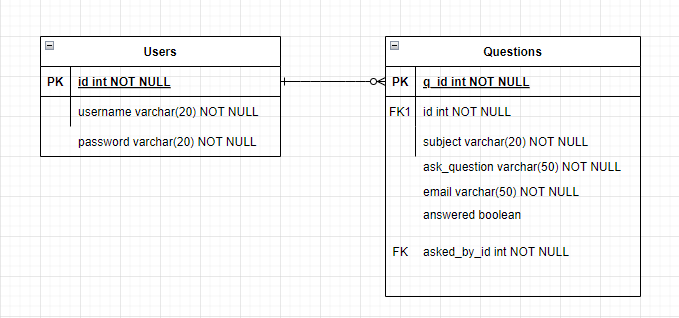

The target for future modifications of the project will be to add an answers category that directly stores users answers for questions through an answers table.
With this modification, the ERD would look like so:

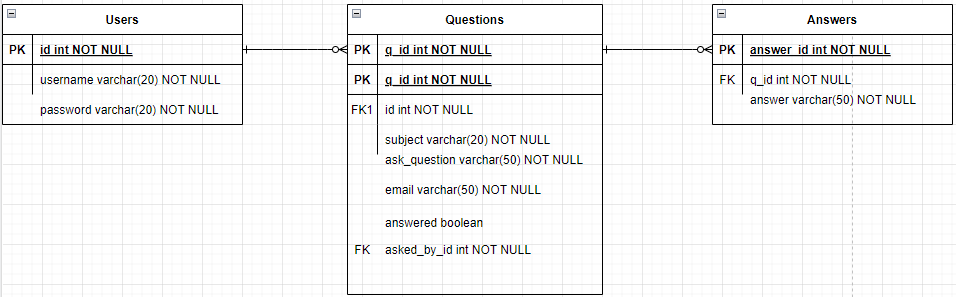

## CI Pipeline: ---

-Trello: Project Tracking
In addition to the requirements, the project required implementation of some stages of a typical CI pipeline. These included project tracking, version control, development environment and a build server. I used Trello to track my project by creating a tracking board. Story points were assigned and MoSCoW prioritisation was used to review and complete functions as the project progressed. Here is the trello board at the start of the project along with a link to view the board. 

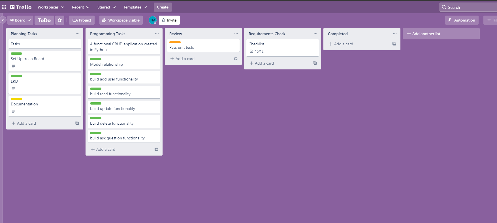

Trello Board:  https://trello.com/b/5dGh4hhf/todo

-Venv: Python Virtual Environment
A python3 virtual evirnonment running ubuntu was used to develop the program. This was connected to through an SSH remote connection to write code in the environment. Flask is a python based frame-work that was also in developing the program.

-Git: Version Control
Git was used for the version control of the project, the repository was hosted on github. 
Version Control with git allows changes to be make and commited to the project with access of commit history to access earlier versions. Using github provided webhooks which sends http POST requests to a build server to automate building and testing.
Functions were created and updated via different branches then merged into dev then into main. Below is a network graph of how this flowed.

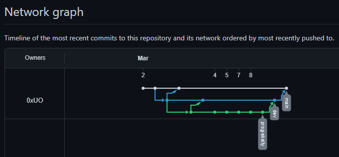

-Jenkins: Build Server
Jenkins was used as a build server, this provided automation of building and testing. The automation was achieved through setting up a freestyle project which executes the test.sh script when it recieves a webhook from github when a commit is pushed from the main branch. 
The full pipeline used in this project is

 Trello <---> Python <---> Git <---> Jenkins 

## RISK ASSESSMENT: ---

Before and after building the app, a risk assessment was drawn up/updated to identify the rirks that could occur during the evolution of the project and how to control these risks.
The risk assessment is displayed below with how the measures could be implemented in the app. 

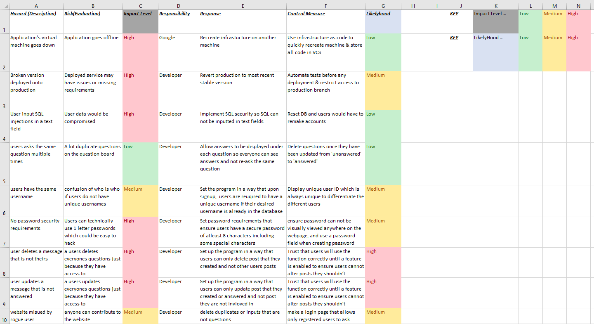

## TESTING: ---

Testing the application was an essential portion of the development process. 
Pytest was used for Unit testing the functions/functionality of the app. Unit tests were written to ensure the Create, Read, Update and Delete functions worked correctly.
These tests were automated through Jenkins using webhooks.
A Coverage report shows what percentage of statements were included in the tests, this was outputted as HTML files produced on Jenkins.
Below is a visualisation of the coverage report.

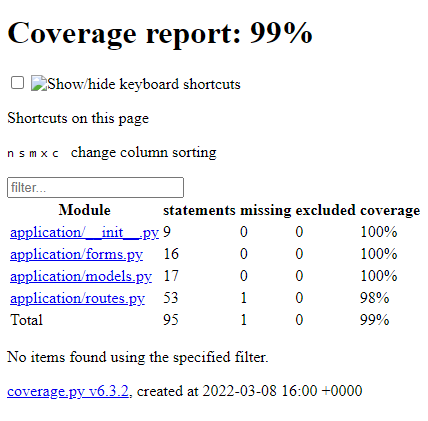

Another form of testing that could be used is Intergration testing using selenium. This would be used to also test the the functions of the program in a fake live environment. This form of testing would be able to simulate keyboard input and mouse clicks to ensure these elements of the program work as intended. Intergration test would be written for all the forms fields within the app to test their functionality.
We need to test whether our components work together when intergrated together.
We have already used integration testing to ensure our app communicates with our database and that it connects by creating new entries, updating our entries and deleting our entries etc.

These tests would not be able to be tested using unit testing.
We will be testing our forms to ensure when a user sumbits data on the forms, we can simulate a user using our app/interface we provide to check it integrates properly with our backend.

The step to Integration test the application using Selenuim would go as followed:

- Download Selenium on our venv
- Download Chromium Browser
scp ~/ install chromium.sh travz@34.105.200.77:/home/travz/qa-project
Install the driver
- create a newfile and call it test_int.py
from flask_testing import LiveServerTestCase
from selenuim import webdriver
from urllib.request import urlopen
from flask import url_for
- Also we would import the app and db from the application folder
- Our forms and models would also need to be imported into this file
- Create a TestBase class
- Create a setUp and tearDown function
- We would then create a class that would test given sample data that would be inputted into the fields 
- This would be followed by a method to define our submit function to pull data from wherever it is
This would be done by opening up the inspect element and locating the desired input box and copying the full Xpath to place inside our function and within that function we would use thr 'send_keys' method to simulate typing something in
We would the do this process for all of our form fields 

This would is the steps that would be taken to integration test our forms/app

## The APP: ---

When navigating the app, the user is presented with the Homepage.

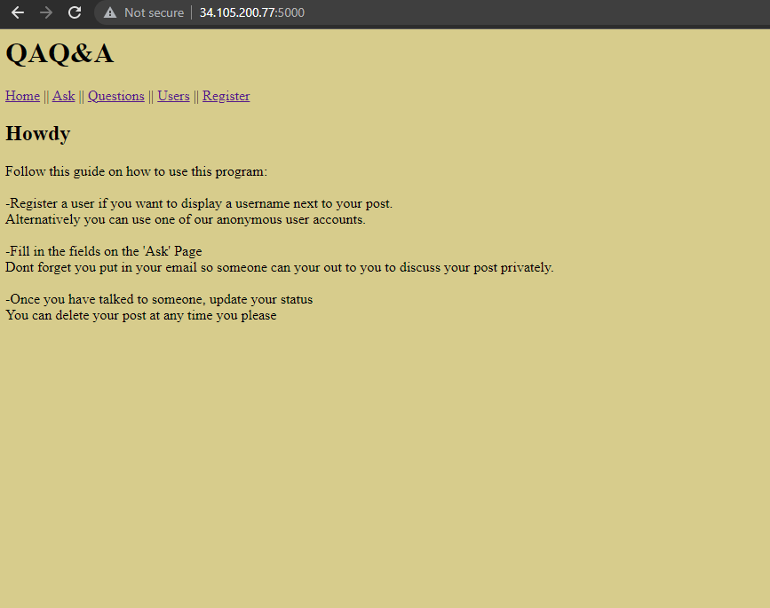

The navbar provides links which allow users to add questions, view questions, register a new user and view all the registered users.

Before adding a new question, the user would likely want to create a user for themselves first using the register page.
this page will allow the user to create a username and password for their user.

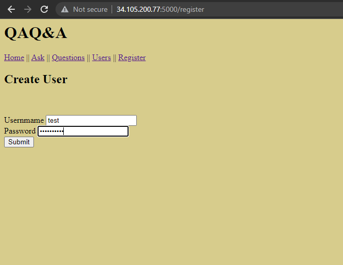

However if a user does not want to create a custom user, the first user created for the program is an 'Anonymous' named account that allows users to ask questions with the username 'anonymous'. However, they would still have to use their own email when creating a question to get a response.
Users can also view all the current created users to know the total amount of users of the application.

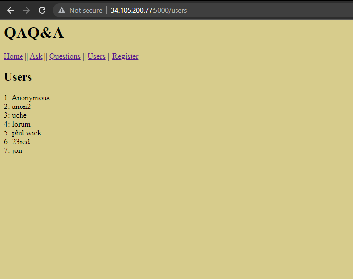

Users can post any questions they like using the ask page, this requires users to input data in all the fields. Some fields had require data validation for the post to be created, this includes the email first as viewers can contact the creator of any post to directly respond to the post via email address until future modifications of the porgram allows users to directly answer question on the same page. 

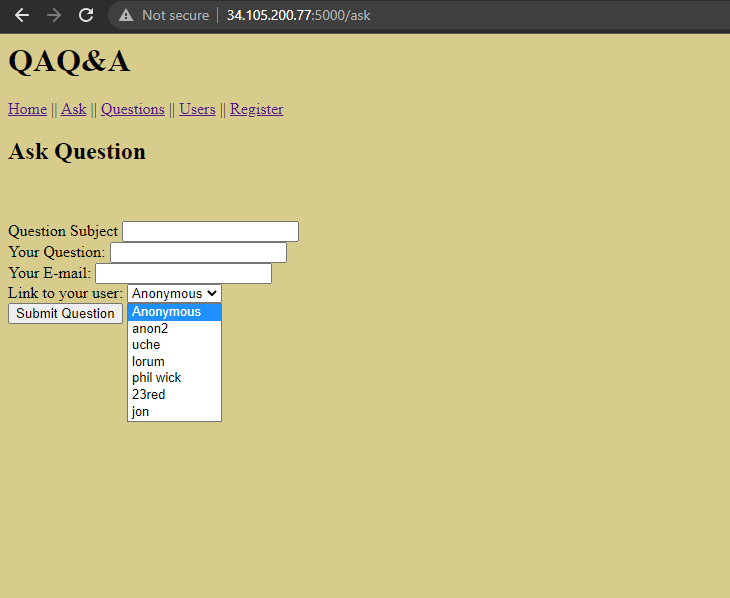

Users can view all the posts that have been created on the questions page and have the ability to delete any post which removes the question from the database.
Users also has the abiliy to update any post which changes the state of the question as to whether the question has been answered or not.

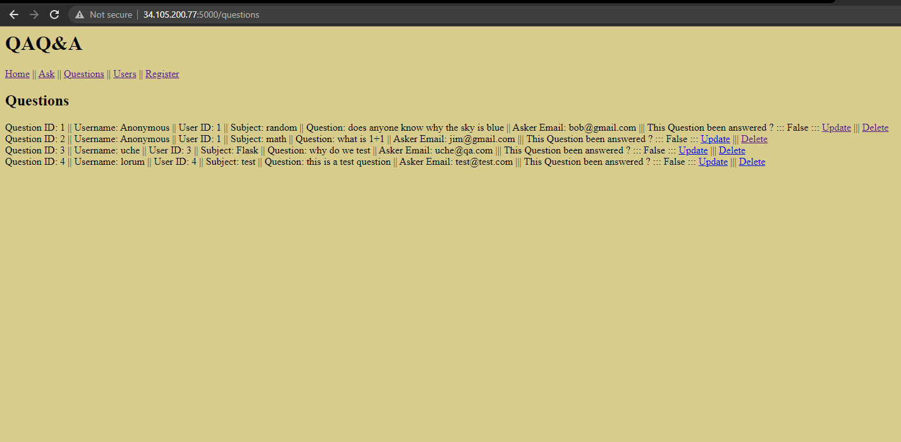

## UPDATES: ---

- Change colour scheme 
- Categorise questions

## ISSUES: ---

Any user is able to update the status of any question whether they asked the question or not
Any user is able to delete any question whether they asked the question or not

## Future Work: ---

In future sprints, i would like to add a feature that allows users to answer questions directly under each post rather than only having the option to mark if a question has been answered through a true or false button as as it stands, questions can only be answered through the email address contact inofrmatoin the asker leaves on the page. As it stands, the program was only desgined this way to meet requirements but has room the upgrade and scale function in the future. 

I would also like to add a chat page where users can chat amougnst each other in one big group chat.

Lastly i would like to update the register/user page to give more security and validation upon creating user accounts. Furthermore, i would like to add user profile where users have have their own profile dedicated to them with all the questions they have asked and answered along with a points system for their amount of contribution.