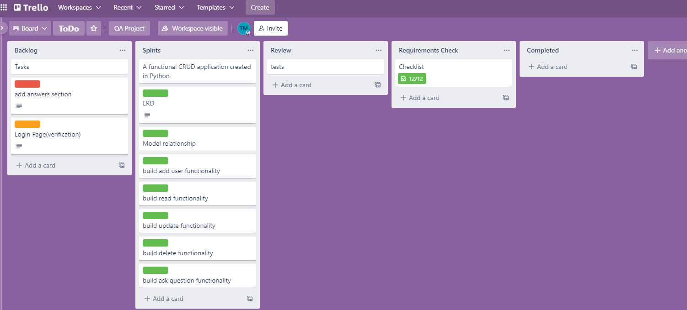
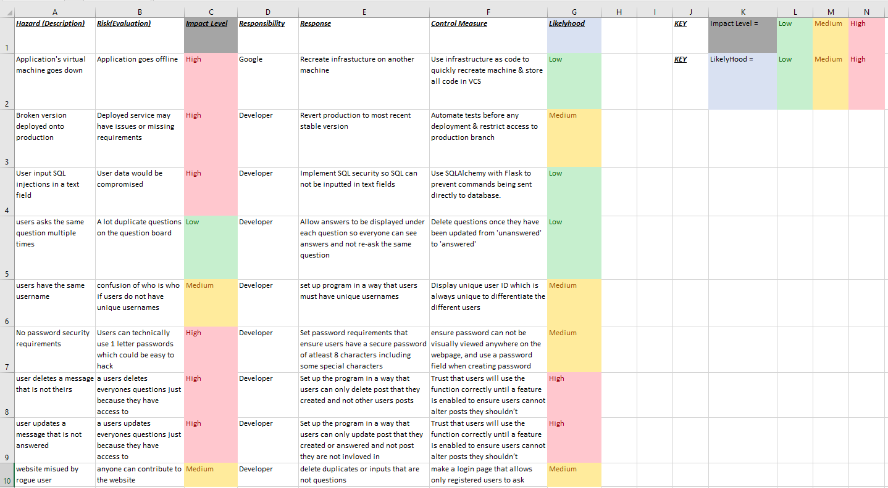

## PROJECT DESCRIPION: ---

The breif for this project was to design and produce a web app of my choice. 
The requirements for the application; included CRUD (create, read update and delete) functionality,
Flask micro-framework, and had to store inofrmation into a MySQL database with a minimum of two tables sharing a one-to-many ralationship:
The Structure is displayed below:

- Insert Picture Here

## APP DESIGN: ---

I have chosen to build a question-bank app, which allows users to write questions to the bank(create functionality).
View questions that have been posted by other users(read functionality).
Update the status of questions whether they have been answered or not (update functionality).
Delete questions(delete functionality).

The database for this program comprises of a Users table and a Questions table which associates with multiple questions to one user(One-To-Many relationship).
The ERD is displayed below: 

The target for future modifications of the project will be an answers category that directly stores users answers for questions though an answers table.
With this modification, the ERD would look like so:

- Insert What New ERD would look like here

## CI Pipeline: ---

-Trello:Project Tracking
In addition to the requirements, the project required implementation of some stages of a typical CI pipeline. These included project tracking, version control, development enironment and a build server. I used Trollo to track my project by creating a tracking board. Story points were assigned and MoSCoW prioritisation was used to review and complete as the project progressed. Here is the trello board at the start of the project along with a list to view the board. 

Trello Board:  https://trello.com/b/5dGh4hhf/todo

Git:Version Control
Git was used for the version control of the project, the repository was hosted on github. 
Version Control with git allows changes to be make and commited to the project with access of commit history to acesses earlier versions. Using github provides webhooks which sends http POST requests to a build server to automate building and testing.

Jenkins:Build Server
Jenkins was used as a build server, this provided automation of building and testing. The automation was achieved through setting up a freestyle project which executes the test.sh script when it recieves a webhook from github when a commit is pushed the main branch. Jenkins is also used to run the app via gunicorn once testing is complete. 
The full pipeline used in this project is

 Trello <---> Python <---> Git <---> Jenkins 

## RISK ASSESSMENT: ---

Prior and whilst building the app, a risk assessment was drawn up to identify the rirks that could occur during the evolution of the project and how to control these risks.
The risk assessment is displayed below with how the measures could be implemented in the app. 

## TESTING: ---

Testing the application was an essential portion of the development process. 
Unit Testing:Pytest
Unit testing was used to test functions/functionality of the app. Unit tests were written to ensure the Create, Read, Update and Delete functions worked correctly.
These tests were automated through Jenkins using webhooks. A successful build in which ass tests passed is displayed below.

A Coverage report shows what percentage of statements were included in the tests, this was outputted as HTML files.
Below is a visualisation of the coverage report

This shows that 99% overall coverage. All tests must pass for the build to be successful, a single failed test marks the overall build as failed.

## The APP: ---

When navigating the app, the user is presented with the Homepage.

The navbar provides links which allow users to add questions, view questions, register a new user and view all the registered users.

To add a new question, the user would likely want to create a user for themselves first using the register page.
this page will allow the user to create a username and password for their user.

However if a user does not want to create a custom user, the first user created for the program was an 'Anonymous' account that allows users to ask questions under an anonymous named user account but they would still have to use their own email when creating a question to get a response.

Users can also view all the current created users to know the total amount of users of the application.

Users can post any questions they like using the ask page, this requires users to input in all the fields, some fields require data for the post to be created, this includes the email first as viewers can contact the creator of any post to directly respond to the post via email address. 

Users can view all the posts that have been created on the questions page and have the ability to delete any post which removes the question from the database and also has the abiliy to update any post which changes the state of the question a to where the question has been answered or not.

## ISSUES: ---

Any user is able to update the status of any question where they asked the question or not
Any user is able to delete  any question whether they asked the question or not

## Future Work: ---

In future sprints, i would like to add a feature that allows users to answer questions directly under each post rather than only having the option to mark if a question has been answered through a true or false button as as it stands, questions can only be answered through the email address contact inofrmatoin the asker leaves on the page. As it stands, the program was only desgined this way to meet requirements but has room the upgrade and scale function in the future. 
